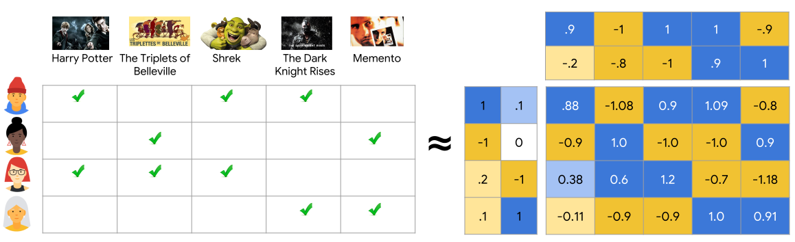

# Matrix Factorization Recommendation Algorithms

This directory contains pure Python implementations of matrix factorization recommendation algorithms. Each algorithm decomposes the user-item rating matrix into lower-dimensional latent factor representations to capture underlying patterns in the data.

## Algorithm Descriptions

### `SVD.py` - Singular Value Decomposition
- **Approach**: Decomposes the rating matrix into user and item factor matrices
- **Implementation**: Stochastic gradient descent optimization with biases
- **Key Feature**: Incorporates user and item biases to capture rating tendencies
- **Advantage**: Efficient for large, sparse datasets with good prediction accuracy

### `SVDpp.py` - SVD++
- **Approach**: Extends SVD by incorporating implicit feedback from user rating patterns
- **Implementation**: Enhanced user representation using both explicit and implicit factors
- **Key Feature**: Considers which items users have rated, not just the rating values
- **Advantage**: Better accuracy than basic SVD, particularly for users with many ratings

### `NMF.py` - Non-negative Matrix Factorization
- **Approach**: Constrains factors to be non-negative for more interpretable results
- **Implementation**: Gradient descent with non-negativity constraints
- **Key Feature**: Normalizes ratings to [0,1] range for better numerical stability
- **Advantage**: Produces more interpretable factors that often correspond to real concepts

### `ALS.py` - Alternating Least Squares
- **Approach**: Alternates between fixing user factors and item factors during optimization
- **Implementation**: Closed-form least squares solutions with confidence weighting
- **Key Feature**: Converts ratings to confidence values for weighted optimization
- **Advantage**: Easily parallelizable and stable convergence properties

### `PMF.py` - Probabilistic Matrix Factorization
- **Approach**: Interprets matrix factorization as a probabilistic model with Gaussian priors
- **Implementation**: Momentum-based gradient descent with adaptive learning rate
- **Key Feature**: Separate regularization parameters for user and item factors
- **Advantage**: Robust to overfitting with principled handling of uncertainty

Each algorithm follows a standardized interface pattern:
1. A pure Python implementation class (e.g., `PureSVD`, `PureNMF`)
2. An adapter class making it compatible with the evaluation framework (e.g., `AdaptedSVD`, `AdaptedNMF`)
3. Built-in evaluation code to test performance against baseline algorithms

## Performance Considerations

- **SVD**: Best general-purpose algorithm with good balance of speed and accuracy
- **SVD++**: Higher accuracy but slower training than SVD
- **NMF**: More interpretable factors but slightly lower accuracy than SVD
- **ALS**: Fastest training for large datasets due to parallelization potential
- **PMF**: Most robust to overfitting when training data is limited

## Implementation Details

All implementations feature:
- Training progress tracking with RMSE reporting
- Adaptive learning rates where applicable
- Proper handling of cold-start situations
- Efficient data structures for sparse data
- Regularization to prevent overfitting
- Normalized predictions within valid rating ranges