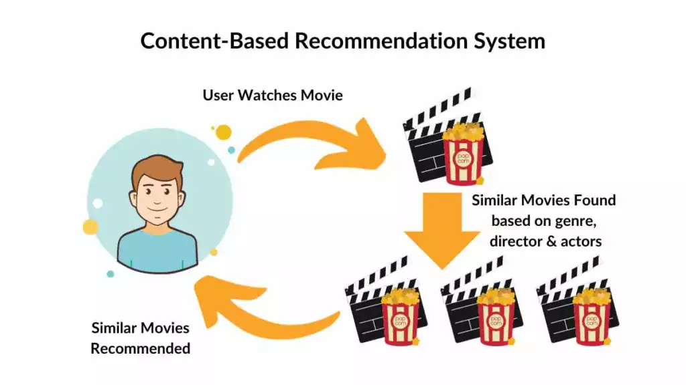

# Content-Based Recommendation Algorithms

This directory contains pure Python implementations of content-based recommendation algorithms. Each algorithm uses movie features such as genres, year of release, and tags to make recommendations, rather than relying solely on user-item interactions.

## Algorithm Descriptions

### `KNN.py` - K-Nearest Neighbors
- **Approach**: Finds movies similar to those a user has rated highly based on content features
- **Implementation**: Custom similarity calculation between movie feature vectors using cosine similarity
- **Key Feature**: Uses genre and year data to create feature vectors for movies
- **Advantage**: Works well even for new movies with few ratings

### `SVM.py` - Support Vector Machines
- **Approach**: Trains a model that separates movies a user likes from those they don't
- **Implementation**: Pure Python implementation of SVM regression using stochastic gradient descent
- **Key Feature**: Creates a separate model for each user to personalize recommendations
- **Advantage**: Good at handling high-dimensional feature spaces

### `NaiveBayes.py` - Naive Bayes Classifier
- **Approach**: Uses Bayesian probability to predict ratings based on movie features
- **Implementation**: Models the probability of rating values given movie attributes
- **Key Feature**: Applies Laplace smoothing to handle sparse data
- **Advantage**: Simple but effective, especially with categorical features like genres

### `DecisionTrees.py` - Decision Tree Regression
- **Approach**: Creates decision rules to predict ratings based on movie attributes
- **Implementation**: Recursive tree building with variance reduction as splitting criterion
- **Key Feature**: Can capture non-linear relationships in the data
- **Advantage**: Highly interpretable model with clear decision paths

### `LogisticRegression.py` - Logistic Regression
- **Approach**: Models the probability that a user will like a movie using a sigmoid function
- **Implementation**: Gradient descent optimization with rating thresholds
- **Key Feature**: Converts the rating prediction problem to binary classification
- **Advantage**: Efficient training and good calibration of probability estimates

### `TFIDF.py` - TF-IDF with Cosine Similarity
- **Approach**: Represents movies as document vectors based on text features
- **Implementation**: Custom TF-IDF computation and on-demand similarity calculation
- **Key Feature**: Uses movie titles, genres, and user-generated tags as text features
- **Advantage**: Excellent for capturing semantic similarities between movies

Each algorithm follows a standardized interface pattern:
1. A pure Python implementation class (e.g., `PureKNN`, `PureSVM`)
2. An adapter class making it compatible with the evaluation framework (e.g., `AdaptedKNN`, `AdaptedSVM`)
3. Built-in evaluation code to test performance against baseline algorithms